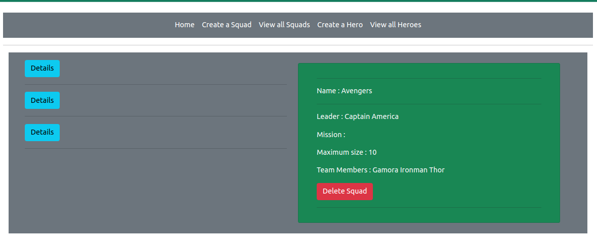
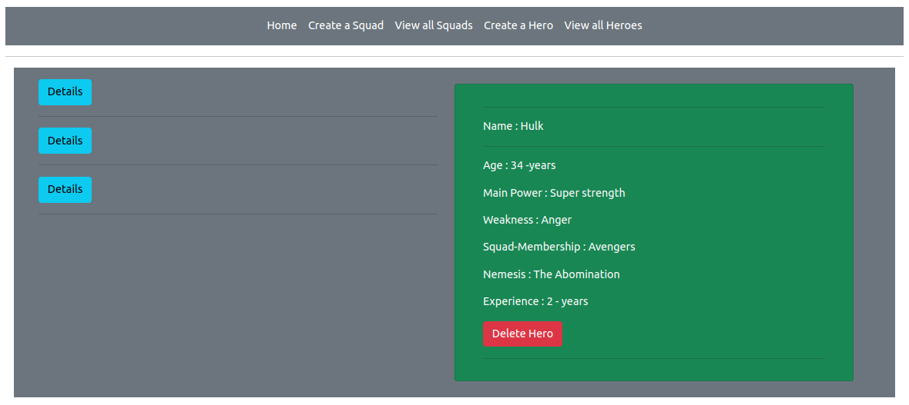

# HERO SQUAD

This is an app that allows you to create and assemble Heroes into a Hero squad, to kick ass and take names, or any other mission the team may deem important. Enjoy.

## ScreenShots

##Project Setup Instructions
- Fork this repo
- Clone this repo
- Open  the project in your desired editor (I use IntelliJ)
- Run the tests and make sure they pass
- Run the app

## Development.

### Built with

- [Java] - 
- [Spark] - To create user interface.
- [Gradle] - To manage dependencies.
- [HTML / CSS] - Created and styled site.

## Want to contribute? Great!

### To fix a bug or enhance an existing module, follow these steps:

- Fork the repo
- Create a new branch (`git checkout -b improve-feature`)
- Make the appropriate changes in the files
- Add changes to reflect the changes made
- Commit your changes (`git commit -am 'Improve feature'`)
- Push to the branch (`git push origin improve-feature`)
- Create a Pull Request

### Bug / Feature Request

If you find a bug or undesired results, or if you'd like to request a new function, feel free to reach out at dennis.muthiora@student.moringaschool.com.

## Team

[Dennis Muthiora ](https://github.com/wdmuthiora)

## [License](https://github.com/iharsh234/WebApp/blob/master/LICENSE.md)

MIT © [Dennis Muthiora ](https://github.com/wdmuthiora)